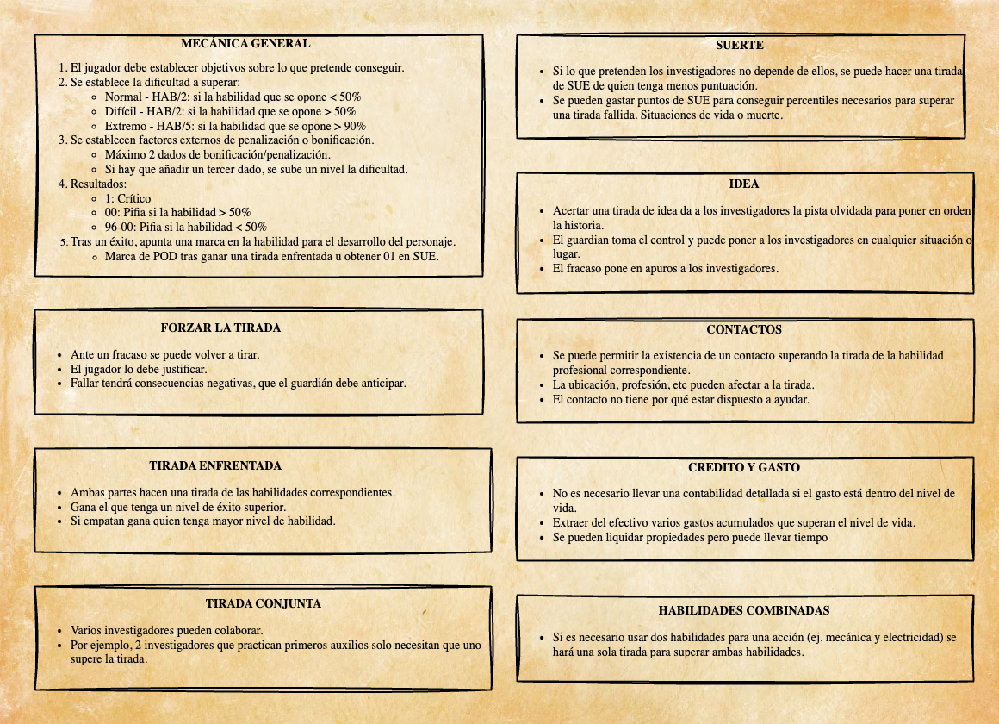
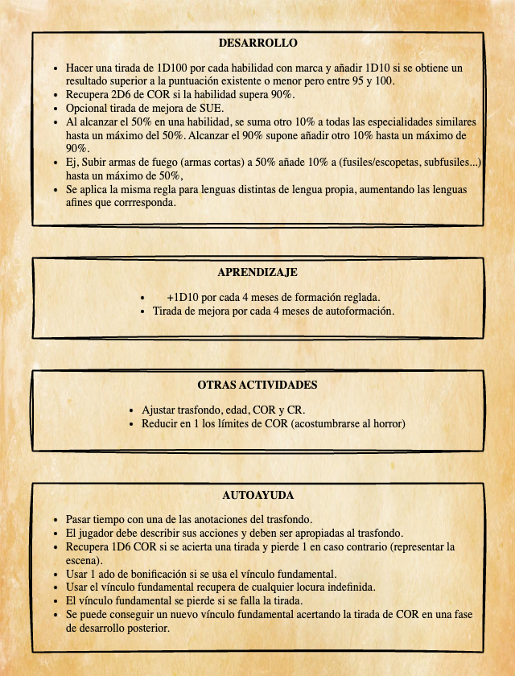
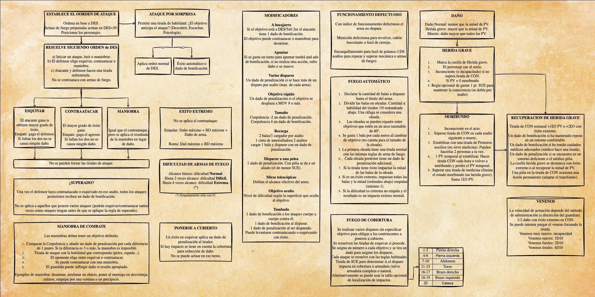
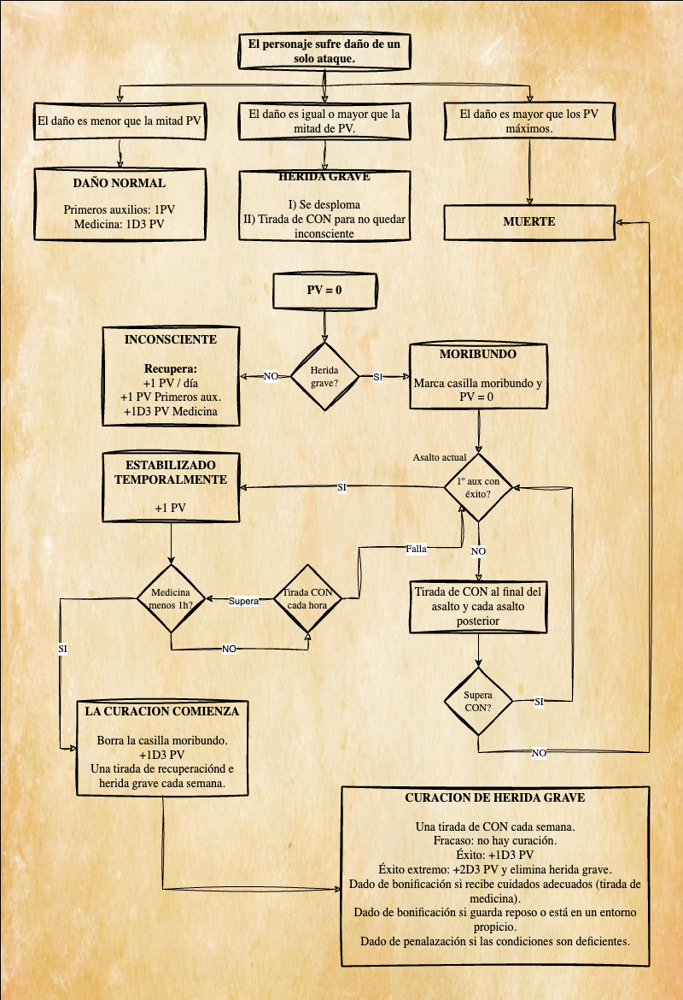
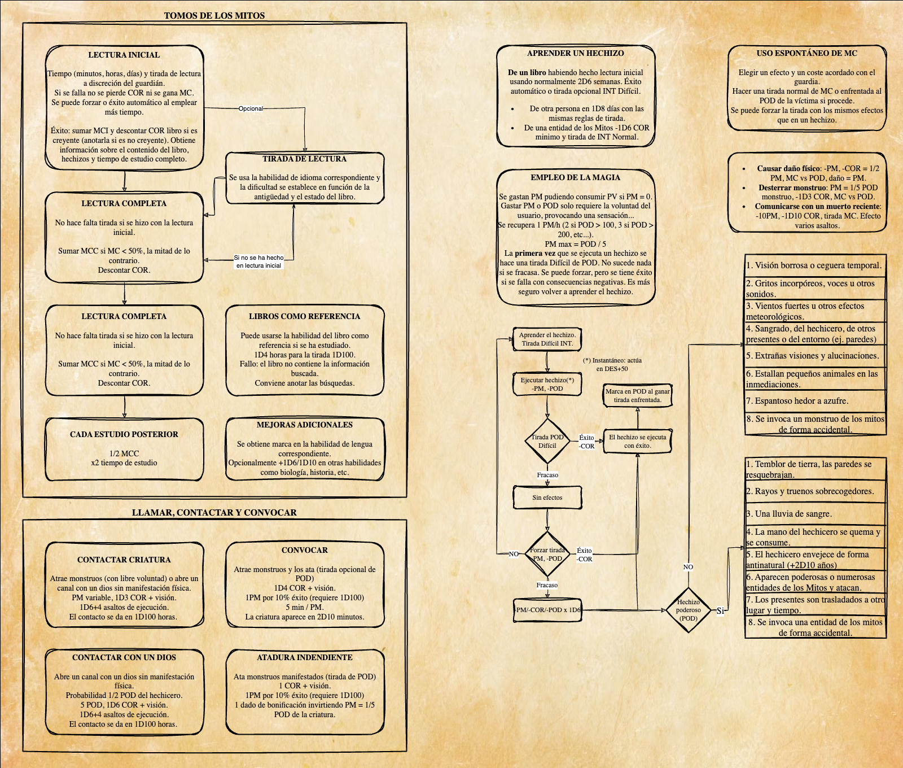

# Cthulhu7ED
Resumen de reglas para la llamada de Cthulhu 7ª Edición

# Indice

- [Sistema general](#sistema-general)
- [Creación de personajes](#creación-de-personajes)
- [Fase de desarrollo de personajes](#fase-de-desarrollo-del-personaje)
- [Combate](#combate)
- [Heridas y recuperación](#heridas-y-recuperación)
- [Persecuciones](#persecuciones)
- [Cordura](#cordura)
- [Magia](#magia-y-hechizos)

# Sistema general

# Creación de personajes

# Fase de desarrollo del personaje

# Combate

# Heridas y recuperación

# Persecuciones

# Cordura

# Magia y hechizos

